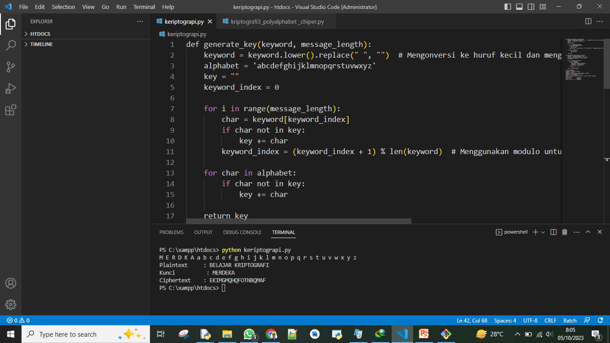

# Kriptografi Pertemuan 3


## Profil
| #               | Biodata                      |
| --------------- | ---------------------------- |
| **Nama**        | M. AKMAL AL ABDILAH          |
| **NIM**         | 312110034                    |
| **Kelas**       | TI.21.A.1                    |
| **Mata Kuliah** | Kriptografi                  |


<p align="center">
 
</p>
<p align="center">
<a href="https://github.com/akmalabdilah"></a>
<p align="center">

<hr>

## Kriptografi membuat sistem  enkripsi  polyalphabet chipper 

<hr>


<p>
1. Tampilan program Python untuk mengimplementasikan enkripsi polialfabetik dengan kunci dan alfabet
</p>



<p>
Seperti yang di tampilkan gambar di atas Merupakan gagasan baru dalam perkembangan kode kaisar untuk menggunakan kunci laian yang di sebut Polyalphabetic. Teknik ini cenderung menggunakan kunci berupa huruf dan tidak ada pengunaan huruf yang di ulang. Penggunaan tidak hanya dengan satu kunci tetapi bisa mengunakan lebih dari satu kunci.


Bisa di coba di bawah ini
</p>


```php
def generate_key(keyword, message_length):
    keyword = keyword.lower().replace(" ", "")  # Mengonversi ke huruf kecil dan menghapus spasi
    alphabet = 'abcdefghijklmnopqrstuvwxyz'
    key = ""
    keyword_index = 0

    for i in range(message_length):
        char = keyword[keyword_index]
        if char not in key:
            key += char
        keyword_index = (keyword_index + 1) % len(keyword)  # Menggunakan modulo untuk melingkupi kunci jika pesan lebih panjang dari kunci
    
    for char in alphabet:
        if char not in key:
            key += char
    
    return key

def polyalphabet_cipher(plaintext, keyword):
    alphabet = 'abcdefghijklmnopqrstuvwxyz'
    plaintext = plaintext.replace(" ", "").lower()
    key = generate_key(keyword, len(plaintext))
    ciphertext = ""
    
    for i in range(len(plaintext)):
        char = plaintext[i]
        if char in alphabet:
            char_index = alphabet.index(char)
            shifted_char = key[char_index]
            ciphertext += shifted_char
        else:
            ciphertext += char
    
    return ciphertext.upper()

# Contoh penggunaan
plaintext = "BELAJAR KRIPTOGRAFI"
keyword = "MERDEKA"
ciphertext = polyalphabet_cipher(plaintext, keyword)
alphabet = "abcdefghijklmnopqrstuvwxyz"
hasil = keyword + alphabet
result = " ".join(dict.fromkeys(hasil))  # Hapus karakter yang sama
print(result)
print("Plaintext     :", plaintext)
print("Kunci          :", keyword)
print("Ciphertext    :",ciphertext)

```


<P>
Oke sekian penjelasan singkat saya mengenai tugas kriptografi kali ini jika kalian masih penasara kalian bisa mencoba file lengkap  polyalphabet chiper code yang ada di atas kurang lebih saya mohon maaf.
</P>

<p>
 sekian and selesai.
</p>

<div>
<h2 align="center">Thanks For Reading!!!</h2>
<div align="center">
